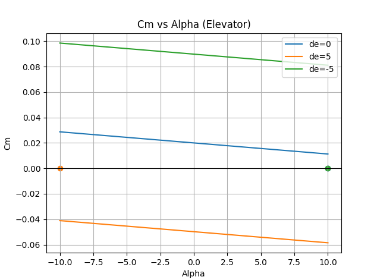
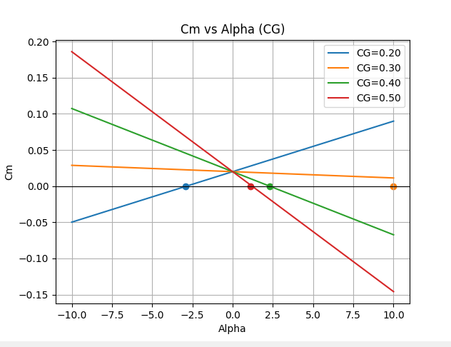
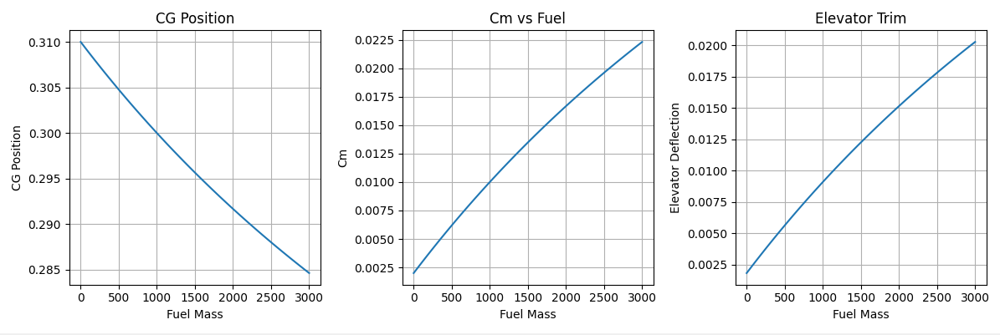

Aircraft Stability Analysis

Overview
This project analyzes aircraft longitudinal stability using Python.
Two aircraft models were studied:
- F-16 Fighter Aircraft
- C-130 Transport Aircraft

F-16 Analysis
- Elevator Deflection Effect
- Pitching Moment Coefficient Analysis
- Center of Gravity Sweep
- Static Stability Evaluation

Example Results:

C-130 Analysis
- Fuel Burn Simulation
- Center of Gravity Tracking
- Stability Limit Detection
- Elevator Trim Compensation

Example Results:

Technologies Used
- Python
- NumPy
- Matplotlib

Skills Demonstrated
- Aircraft Stability Analysis
- Aerodynamics Fundamentals
- Data Visualization
- Engineering Programming
- Numerical Computation

Author
Ahmed Ramadan
